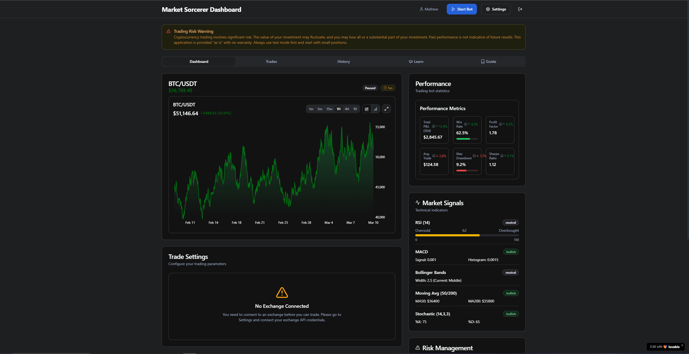

# Market Sorcerer - Automated Cryptocurrency Trading Bot



Market Sorcerer is a powerful, customizable trading bot that helps you automate your cryptocurrency trading strategies. With a user-friendly interface and a variety of pre-built strategies, Market Sorcerer enables both beginners and experienced traders to participate in the crypto markets with confidence.

## Features

- **Multi-Exchange Support**: Connect to popular exchanges like Binance, Coinbase, and Kraken
- **Pre-built Trading Strategies**: Choose from momentum, trend-following, mean-reversion, and DCA strategies
- **Advanced Backtesting**: Test your strategies against historical data before risking real capital
- **Real-time Market Data**: Monitor live market conditions, signals, and performance metrics
- **Risk Management**: Implement stop losses, take profits, and position sizing to protect your capital
- **Paper Trading**: Test your strategies in real-time with simulated money
- **Performance Analytics**: Track your bot's performance with detailed metrics and charts

## Getting Started

### Prerequisites

- Node.js (v16 or higher)
- npm or yarn package manager
- API keys from your preferred cryptocurrency exchange

### Installation

1. Clone the repository:
```bash
git clone https://github.com/yourusername/market-sorcerer.git
cd market-sorcerer
```

2. Install dependencies:
```bash
npm install
# or
yarn install
```

3. Start the development server:
```bash
npm run dev
# or
yarn dev
```

4. Open your browser and navigate to `http://localhost:8080`

## Usage

1. **Connect your exchange**:
   - Navigate to Settings
   - Select your exchange
   - Enter your API keys
   - Enable test mode for paper trading

2. **Select a strategy**:
   - Choose from pre-built strategies or customize your own
   - Adjust parameters based on your risk tolerance

3. **Backtest your strategy**:
   - Test against historical data
   - Analyze performance metrics
   - Refine strategy parameters

4. **Start trading**:
   - Begin with paper trading to validate your strategy
   - Monitor performance in real-time
   - Switch to live trading when confident

## Strategy Types

### Momentum Strategies
Use technical indicators like RSI to identify overbought and oversold conditions in the market.

### Trend Following Strategies
Capture gains by following market trends using moving average crossovers.

### Mean Reversion & Volatility Strategies
Use Bollinger Bands and other volatility indicators to identify price extremes.

### Dollar Cost Averaging (DCA)
A passive investment strategy that buys a fixed dollar amount at regular intervals.

## Risk Management

- **Position Sizing**: Limit exposure to 1-2% of your portfolio per trade
- **Stop Loss**: Protect capital by setting appropriate stop losses
- **Take Profit**: Secure gains with strategic profit targets
- **Maximum Open Positions**: Control overall portfolio risk

## Advanced Configuration

Refer to the in-app user guide for detailed instructions on:

- Multi-strategy implementation
- Market condition filters
- Custom indicator settings
- Advanced risk parameters

## Troubleshooting

For common issues and their solutions, check the in-app troubleshooting guide or open an issue on GitHub.

## Contributing

We welcome contributions to Market Sorcerer! Please feel free to submit pull requests or open issues to suggest improvements.

1. Fork the repository
2. Create a feature branch: `git checkout -b feature/amazing-feature`
3. Commit your changes: `git commit -m 'Add some amazing feature'`
4. Push to the branch: `git push origin feature/amazing-feature`
5. Open a pull request

## License

This project is licensed under the MIT License - see the LICENSE file for details.

## Disclaimer

Trading cryptocurrencies involves significant risk and can result in the loss of your invested capital. Do not trade with funds you cannot afford to lose. Market Sorcerer is provided as-is with no guarantees of profitability. Always perform your own due diligence before implementing any automated trading strategy.

